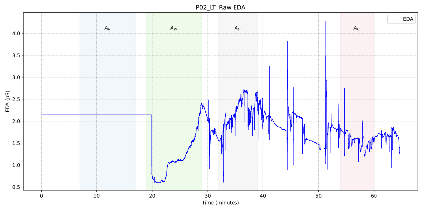
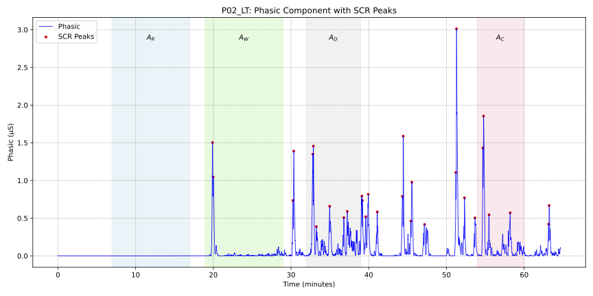
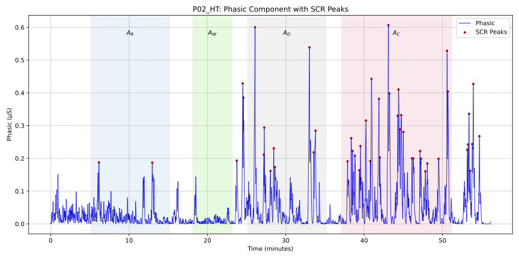

# Study on Subjective Comfort and Sympathetic Arousal among Office Occupants

## Study Description

### Objective

The primary goal of this experiment was to assess how environmental conditions, particularly varition in therml conditions, impact the perception of comfort and productivity among office occupants. The study focused on how personal characteristics affect multi-domain comfort perception by monitoring physiological responses, complemented by survey-based validation.

### Experimental Setup

A total of 26 participants were involved in the experiment study. Each participant was required to perform a series of activities  *(reading, writing, discussion, call)* in an office setting, with two participants present at a time in the office room. The experiment was conducted in two seperate sessions under different temperature conditions i.e. low-temperature (22°C) and high-temperature (30°C), concluding as the only environmental variable altered between two sessions. Each session was paired with a different activity content to ensure variation in the cognitive tasks while maintaining the activity occurance.

### Activities

Participants were asked to perform the following tasks in both the low-temperature and high temperature settings:
1. Reading: Reading an article on a specific topic.
2. Writing: Writing a summary based on the article they had just read.
3. Discussion: Engaging in a discussion with a colleague about the same topic.
4. Conference Call: Participating in a conference call to further discuss the topic.

### Study Pipeline

## Wearable Sensor Overview
### EmotiBit Device

EmotiBit is a wearable sensor platform designed for real-time physiological data collection. It typically attaches to the back of an existing wearable device, such as a smartwatch, and measures a range of biometric signals including:

    - Electrodermal Activity (EDA): Measures skin conductance, which is associated with sweat gland activity and can indicate psychological or physiological arousal.
    - Electrocardiogram (ECG): Measures electrical activity of the heart.
    - Photoplethysmography (PPG): Measures blood volume changes, commonly used for heart rate monitoring.
    - Temperature: Measures skin temperature.
    - Accelerometer and Gyroscope: Measures motion and orientation.
    - Inertial Measurement Unit (IMU): Combines accelerometer and gyroscope data to capture movement in 3D space.

    
The data column contains the following physiological and device signals:

    acx, acy, acz: Accelerometer data along x, y, and z axes.
    bat: Battery level of the device.
    eda: Electrodermal Activity data.
    edl: Probably Electrodermal Level or some related measure.
    gyx, gyy, gyz: Gyroscope data along x, y, and z axes.
    mgx, mgy, mgz: Magnetometer data along x, y, and z axes.
    pgg, pgi, pgr: Possibly related to photoplethysmography (PPG) or other physiological signals.
    thr: Could be related to a threshold or temperature measurement.
    device_address and user_id: Metadata related to the device and user.

## Visualization
### Raw data instance for individual (P02) participant data:

### SCR peaks instance for individual (P02) participant data during LT session:

### SCR peaks instance for individual (P02) participant data during HT session:

